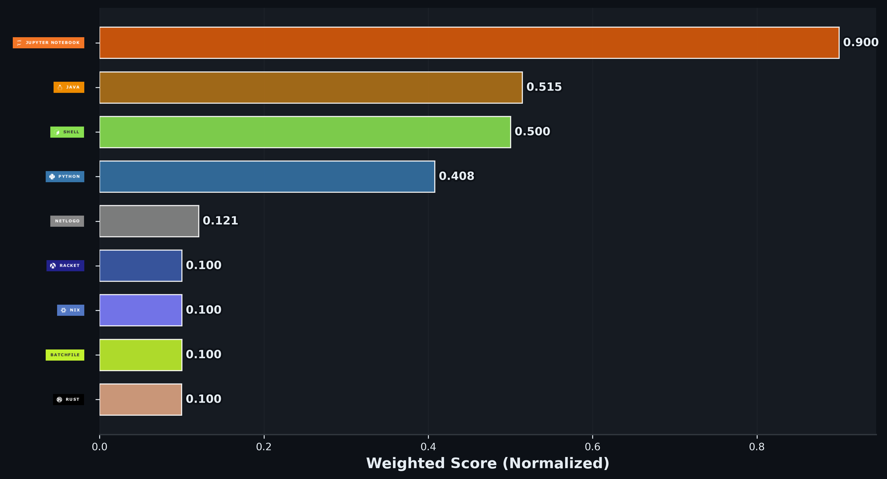

# kccaterworld

## 

 

 

 

I'm Kemal (they/them), a high schooler just trying to survive the stress while also teaching myself three different programming languages outside of class.
I'm not great, but I'm working on improving and growing my skillset.
This is my GitHub account, where I have repos for some of my [AI research](https://github.com/kccaterworld/inspiritwork),
[my high school comp sci classes](https://github.com/kccaterworld/kcater70IntroToCS),
and [my own personal website](https://github.com/kccaterworld/kccaterworld.github.io) hosted.

You can also find my [soap store](https://go.caterworld.xyz/sudsysoapstore), which is hosted on GitLab, and was written and is still maintained by me.

Feel free to reach out, I'll respond as quickly as I can. 

## 🔭 Current Major Projects:
I'm working on various types of data representation and visualization, including [hashing, ciphers, and encryption](https://github.com/kccaterworld/encryption).
This project is in collaboration with [my friend, Melody-TG](https://github.com/Melody-TG). The current major programs are
[Caesar](https://github.com/kccaterworld/encryption/tree/main/Caesar) and [Hash](https://github.com/kccaterworld/encryption/tree/main/Hash),
although I plan to work on adding compression algorithms and Vigenère ciphers.

I'm also exploring rendering and game development with [Game of Life](https://github.com/kccaterworld/game-of-life), which is Conway's Game of Life implemented in Python
using a few different rendering methods, including Pygame. The skills I learn from this project will be used for my rendering engine, which is still in the planning stages.
Eventually I want to implement this in Rust as well, although I'm still learning Rust so that's a long way off.

Game of Life is intended to be a stepping stone into more complex rendering, and once I finish that I hope to build a custom 2d and even 3d rendering engine
from scratch. I'm currently working on learning the math behind 3d rendering, and once I have a good grasp of that I will start actually implementing an engine.

## 🧠 Skills

### 💬 Languages

### ⚡ Tools & Libraries

### 🌱 Learning

## 💻 My various projects on here

### [My Personal Repository](https://github.com/kccaterworld/kccaterworld)
Most of my single-file or small scale projects are in here, just to access files between devices.

Currently only contains my profile README

Repository Structure:

- [README.md](https://github.com/kccaterworld/kccaterworld/blob/main/README.md): This README file

### [Game-of-Life](https://github.com/kccaterworld/game-of-life)
The repository for my implementation of Conway's Game of Life.

 Repository Structure: 

- [README.md](https://github.com/kccaterworld/game-of-life/blob/main/README.md): README file for this Repository
- [Python](https://github.com/kccaterworld/game-of-life/blob/main/Python): Contains all the Python files
  - gol.ipynb: Main Jupyter Notebook containing the PyOpenGL and Pygame implementations
  - golarc.py: Code for implementing with the Arcade library
  - golwx.py: Code for implementing with the wxPython library
  - 2dgol.py: Eventual code for 2D implementation using Pygame, currently empty
- [Rust](https://github.com/kccaterworld/game-of-life/blob/main/Rust): Contains all the Rust files
  - game-of-life: Cargo project for Game of Life in Rust, currently empty
- [Assets](https://github.com/kccaterworld/game-of-life/blob/main/assets): Contains all the assets for the project
  - Sprites: Contains sprite images for the project, used in Arcade implementation

### [Encryption](https://github.com/kccaterworld/encryption)

The repository for my encryption repository.

Although it's called encryption, it's largely focused on data representation, and also includes hashing, ciphers, encoding and decoding, and compression.

Collaboration between me and [Melody-TG](https://github.com/Melody-TG), more people are welcome to contribute! Contributing guide
can be found in [CONTRIBUTING.md](https://github.com/kccaterworld/encryption/blob/main/CONTRIBUTING.md) or near the repository README.

Future plans and goals:
- Implement more ciphers, including Vigenère ciphers and 

Repository Structure:

- [README.md](https://github.com/kccaterworld/encryption/blob/main/README.md): README file for this Repository.
- [Caesar](https://github.com/kccaterworld/encryption/tree/main/Caesar): Contains all the Caesar Cipher files, Main contributor: kccaterworld
  - Wordlists: Folder containing text files with wordlists for decryption brute force validation
  - [README.md](https://github.com/kccaterworld/encryption/blob/main/Caesar/README.md): README file for the Caesar Cipher project
  - caesar.ipynb: Jupyter Notebook for initial development and testing, highly experimental
  - caesar.py: Official Caesar cipher Python file, stable, can be imported as a module
- [Compression](https://github.com/kccaterworld/encryption/tree/main/Compression): Contains all the compression algorithm files, Main contributor: kccaterworld
  - compression.ipynb: Jupyter Notebook for initial development and testing of compression algorithms
- [Hash](https://github.com/kccaterworld/encryption/tree/main/Hash): Contains all the hash files, Main contributor: kccaterworld
  - hashing.ipynb: Jupyter Notebook for initial development and testing of hashing algorithms
- [RSA](https://github.com/kccaterworld/encryption/tree/main/RSA): Contains all the RSA encryption files, Main contributor: kccaterworld
  - data.txt: Text file containing data for testing RSA encryption and decryption
  - encodeddata.txt: Text file containing base64 encoded data for verification
  - rsa.ipynb: Jupyter Notebook for main development and testing of RSA encryption
  - rsa.py: Python file, unstable, not ready for use yet
- [Translation](https://github.com/kccaterworld/encryption/tree/main/Translation): Contains all the translation files, Main contributor: Melody-TG
  - baseconvert.py: Implementation of conversion between different integer bases
  - Translator.py: Implementation of text translation between different integer bases

## ✍️ Silly Lil Random Dev Quote

## 📫 How to reach me:
 

 

[Back To The Top](#kccaterworld)
