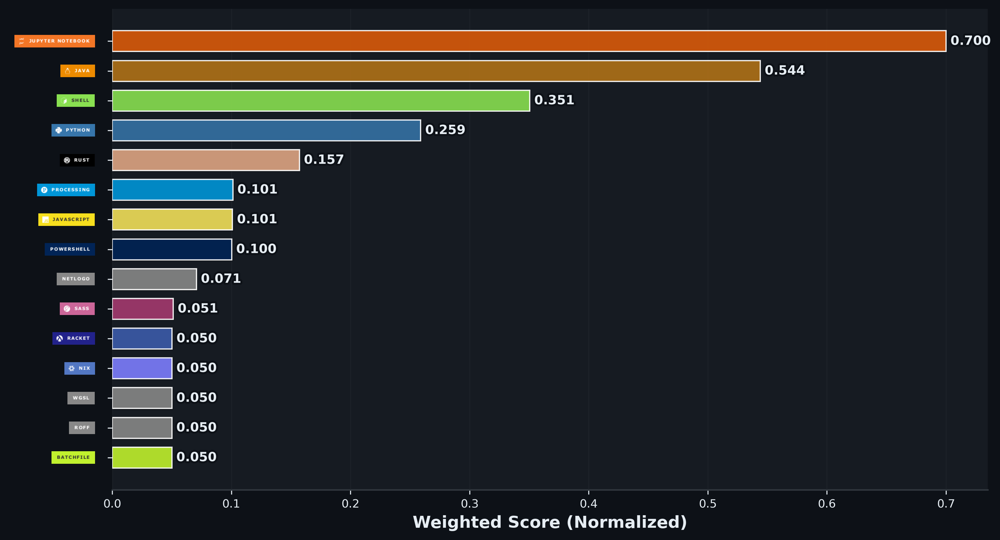

# kccaterworld

## 

I'm Kemal (they/them), a high schooler just trying to survive the stress while also teaching myself three different programming languages outside of class.
I'm not great, but I'm working on improving and growing my skillset.
This is my GitHub account, where I have repos for some of my [AI research](https://github.com/kccaterworld/inspiritwork),
[my high school comp sci classes](https://github.com/kccaterworld/kcater70IntroToCS),
and [my own portfolio](https://github.com/kccaterworld/kccaterworld.github.io) hosted.

You can also find my [soap store](https://go.caterworld.xyz/sudsysoapstore), which is hosted on GitLab, and was written and is still maintained by me.

Feel free to reach out, I'll respond as quickly as I can.

## 🔭 Current Major Projects:

My main project is a framework called [Kanvas](https://github.com/kccaterworld/kanvas), a drawing and rendering framework written and based on Java. I'm not only learning how to do rendering, but also code parsing and processing. Eventually it will include dependency support, a custom build system, and GPU optimized 3D rendering.

I'm also working with machine learning, audio manipulation, and UI design in [Kocoder](https://github.com/kccaterworld/Kocoder), an DAW (Digital Audio Workstation) written in Java and Python that uses open source hand landmarking models to detect and track hand movements in real-time. It then translates those movements into audio effects and synthesizer control.

I'm also been learning and working with various types of data representation and visualization, including [hashing, ciphers, and encryption](https://github.com/kccaterworld/encryption). This project is in collaboration with [my friend, Melody-TG](https://github.com/Melody-TG). The current major programs are [Caesar](https://github.com/kccaterworld/encryption/tree/main/Caesar) and [Hash](https://github.com/kccaterworld/encryption/tree/main/Hash), although I plan to work on adding compression algorithms and Vigenère ciphers.

## 🧠 Skills

### 💬 Languages

### ⚡ Tools & Libraries

### 🌱 Learning

## 💻 My various projects on here

### [My Personal Repository](https://github.com/kccaterworld/kccaterworld)
Most of my single-file or small scale projects are in here, just to access files between devices.

Currently only contains my profile README

Repository Structure:

- [README.md](https://github.com/kccaterworld/kccaterworld/blob/main/README.md): This README file

### [Kanvas](https://github.com/kccaterworld/kanvas)
Kanvas is an alpha-stage creative coding toolkit for Java that combines a CLI, project templates, and a .kvs sketch preprocessor to streamline visual app development. It includes config-driven builds (kanvas.toml), run/build commands, and an AWT-based rendering runtime, with plans for stronger dependency management and packaging support.

Repository Directory Structure: 

- [README.md](https://github.com/kccaterworld/kanvas/blob/main/README.md): README file for this Repository
- [docs](https://github.com/kccaterworld/kanvas/blob/main/docs): Kanvas documentation
- [src](https://github.com/kccaterworld/kanvas/blob/main/src): All the source code
    - [kanvas](https://github.com/kccaterworld/kanvas/blob/main/src/kanvas)
        - [assets](https://github.com/kccaterworld/kanvas/blob/main/src/kanvas/assets)
            - [templates](https://github.com/kccaterworld/kanvas/blob/main/src/kanvas/assets/templates)
            - [text](https://github.com/kccaterworld/kanvas/blob/main/src/kanvas/assets/text)
        - [builder](https://github.com/kccaterworld/kanvas/blob/main/src/kanvas/builder)
        - [cli](https://github.com/kccaterworld/kanvas/blob/main/src/kanvas/cli)
        - [config](https://github.com/kccaterworld/kanvas/blob/main/src/kanvas/config)
        - [gui](https://github.com/kccaterworld/kanvas/blob/main/src/kanvas/gui)
        - [libs](https://github.com/kccaterworld/kanvas/blob/main/src/kanvas/libs)
            - [math](https://github.com/kccaterworld/kanvas/blob/main/src/kanvas/libs/math)
        - [preprocess](https://github.com/kccaterworld/kanvas/blob/main/src/kanvas/preprocess)
        - [project](https://github.com/kccaterworld/kanvas/blob/main/src/kanvas/project)
        - [runtime](https://github.com/kccaterworld/kanvas/blob/main/src/kanvas/runtime)
- [testing](https://github.com/kccaterworld/kanvas/blob/main/testing): Testing suite for Kanvas
- LICENSE
- NOTICE

### [Encryption](https://github.com/kccaterworld/encryption)

The repository for my encryption repository.

Although it's called encryption, it's largely focused on data representation, and also includes hashing, ciphers, encoding and decoding, and compression.

Collaboration between me and [Melody-TG](https://github.com/Melody-TG), more people are welcome to contribute! Contributing guide
can be found in [CONTRIBUTING.md](https://github.com/kccaterworld/encryption/blob/main/CONTRIBUTING.md) or near the repository README.

Future plans and goals:
- Implement more ciphers, including Vigenère ciphers and 

Repository Structure:

- [README.md](https://github.com/kccaterworld/encryption/blob/main/README.md): README file for this Repository.
- [Caesar](https://github.com/kccaterworld/encryption/tree/main/Caesar): Contains all the Caesar Cipher files, Main contributor: kccaterworld
  - Wordlists: Folder containing text files with wordlists for decryption brute force validation
  - [README.md](https://github.com/kccaterworld/encryption/blob/main/Caesar/README.md): README file for the Caesar Cipher project
  - caesar.ipynb: Jupyter Notebook for initial development and testing, highly experimental
  - caesar.py: Official Caesar cipher Python file, stable, can be imported as a module
- [Compression](https://github.com/kccaterworld/encryption/tree/main/Compression): Contains all the compression algorithm files, Main contributor: kccaterworld
  - compression.ipynb: Jupyter Notebook for initial development and testing of compression algorithms
- [Hash](https://github.com/kccaterworld/encryption/tree/main/Hash): Contains all the hash files, Main contributor: kccaterworld
  - hashing.ipynb: Jupyter Notebook for initial development and testing of hashing algorithms
- [RSA](https://github.com/kccaterworld/encryption/tree/main/RSA): Contains all the RSA encryption files, Main contributor: kccaterworld
  - data.txt: Text file containing data for testing RSA encryption and decryption
  - encodeddata.txt: Text file containing base64 encoded data for verification
  - rsa.ipynb: Jupyter Notebook for main development and testing of RSA encryption
  - rsa.py: Python file, unstable, not ready for use yet
- [Translation](https://github.com/kccaterworld/encryption/tree/main/Translation): Contains all the translation files, Main contributor: Melody-TG
  - baseconvert.py: Implementation of conversion between different integer bases
  - Translator.py: Implementation of text translation between different integer bases

## ✍️ Silly Lil Random Dev Quote

## 📫 How to reach me:
 

 

[Back To The Top](#kccaterworld)
